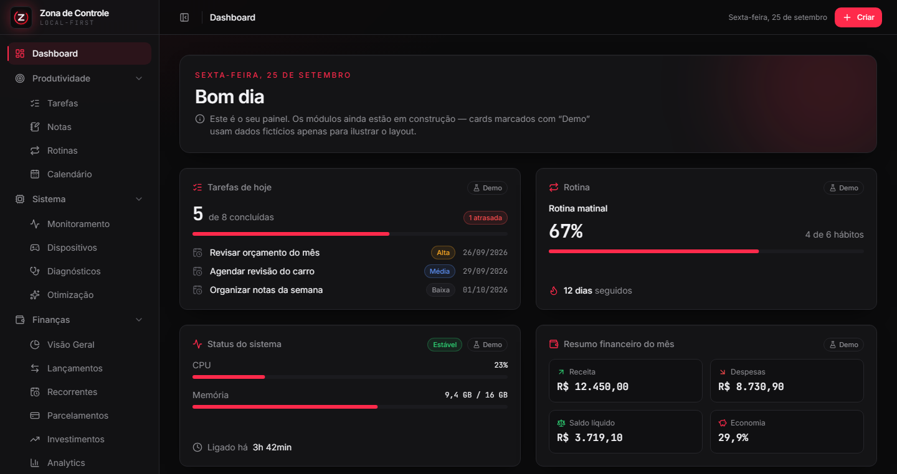

# Zona de Controle

[](https://github.com/BrunoStrufaldi/Zona-de-controle/actions/workflows/ci.yml)

> Hub de produtividade pessoal, central do sistema e gestão financeira — um app desktop **local-first** para Windows.



## Visão geral

O **Zona de Controle** reúne em um só lugar três áreas do dia a dia:

- **Produtividade pessoal**: tarefas, notas, rotinas e calendário.
- **Central do sistema**: monitoramento de hardware, diagnóstico, dispositivos/bateria e otimização **segura**.
- **Gestão financeira**: lançamentos, contas recorrentes, parcelamentos, investimentos e analytics.

Tudo roda localmente. Os dados ficam em um banco SQLite no seu computador, sem nuvem, sem contas e sem APIs externas.

> **Estado atual: Fase 2 em andamento.** A fundação está pronta e o módulo de **Tarefas** já funciona (lista, Kanban, recorrência, checklists, categorias, arquivo e dashboard). Os demais módulos serão implementados um a um (veja o [Roadmap](#roadmap)). Os cards do dashboard marcados com **Demo** usam dados fictícios só para ilustrar o layout.

## Stack

| Camada            | Tecnologia                                                   | Por quê                                                                                                                            |
| ----------------- | ------------------------------------------------------------ | ---------------------------------------------------------------------------------------------------------------------------------- |
| Desktop           | **Tauri 2** (Rust)                                           | Binário pequeno, usa o WebView2 nativo do Windows, com modelo de permissões granular (capabilities) e acesso seguro ao SO via Rust |
| Linguagem nativa  | **Rust** (stable)                                            | Segurança de memória e acesso ao sistema (bateria, discos, arquivos) sem expor nada ao JavaScript                                  |
| UI                | **React 19 + TypeScript 6 (strict)**                         | Ecossistema maduro, tipagem forte de ponta a ponta                                                                                 |
| Build             | **Vite 8**                                                   | Dev server rápido, HMR e code splitting por rota                                                                                   |
| Rotas             | **React Router 8** (data router)                             | Rotas declarativas, carregamento sob demanda e tratamento de erro por rota                                                         |
| Estilo            | **Tailwind CSS 4** + tokens em CSS variables                 | Tema centralizado e fácil de trocar, sem CSS espalhado                                                                             |
| Componentes       | Padrão **shadcn/ui** (Radix UI + CVA)                        | Acessibilidade pronta (Radix) com código dentro do projeto, sem lock-in                                                            |
| Ícones            | **Lucide React**                                             | Conjunto consistente e leve                                                                                                        |
| Estado global     | **Zustand**                                                  | Mínimo e sem boilerplate. Usado só para estado de UI                                                                               |
| Gráficos          | **Recharts**                                                 | Declarativo, integra bem com React e aceita os tokens do tema                                                                      |
| Arrastar e soltar | **@dnd-kit** (core + sortable)                               | Kanban acessível: funciona com mouse e teclado, com anúncios para leitores de tela                                                 |
| Toasts            | **Sonner**                                                   | Notificações acessíveis, recomendadas pelo shadcn                                                                                  |
| Banco             | **SQLite via `rusqlite` (bundled)**                          | Arquivo único local; o SQLite vem embutido, sem instalação. **Todo SQL fica no Rust**                                              |
| Testes            | **Vitest + Testing Library** / `cargo test`                  | Testes rápidos e o mesmo pipeline do Vite                                                                                          |
| Qualidade         | ESLint (type-checked), Prettier, `cargo fmt`, `cargo clippy` | Padrão consistente e verificável                                                                                                   |

### Decisões técnicas

- **SQLite só no Rust.** O frontend nunca executa SQL: ele chama commands tipados (`src/services`). Por isso o plugin SQL do Tauri **não** é usado.
- **TypeScript fixado em 6.0.** O TS 7 já existe, mas o `typescript-eslint` ainda não o suporta. A atualização fica para quando houver compatibilidade.
- **Tauri 2 estável.** A versão 3 está em alpha.
- **`freezePrototype` desativado.** A opção quebra o `decimal.js-light` (dependência do Recharts), que redefine `valueOf` no próprio protótipo. A segurança continua garantida pela CSP e pelo modelo de capabilities.
- **Fontes empacotadas** (`@fontsource-variable`). Nenhuma requisição ao Google Fonts ou a qualquer servidor externo.

## Funcionalidades

### Produtividade (Fase 2)

- **Tarefas** ✅ (2.1 e 2.2): lista e Kanban, status, prioridades, vencimento com destaque (atrasada, hoje, em breve), tags, busca e filtros, recorrência, checklists, categorias e arquivamento.
- **Notas e diário**: editor Markdown, notas rápidas, diário por data, busca, tags, favoritos, pastas e histórico.
- **Rotinas**: rotinas diárias e semanais, hábitos, histórico de execução e indicadores de consistência.
- **Calendário**: eventos, lembretes, recorrência, notificações locais e visões mensal, semanal e diária.

### Monitoramento do sistema (Fases 3 e 4)

- **Hardware**: CPU, RAM, armazenamento, discos, temperatura (quando suportada), processos e informações do sistema.
- **Diagnóstico**: alertas de armazenamento, recomendações e histórico de métricas.
- **Dispositivos e bateria**: periféricos com nível de bateria, carregamento, tipo de conexão e última atualização. A leitura vem de providers independentes:
  - `BluetoothBatteryProvider`: Battery Service padrão do Bluetooth;
  - `XInputBatteryProvider`: controles Xbox (nível por faixas);
  - `HidVendorProvider`: receptores 2.4 GHz proprietários, com um plugin por modelo, somente leitura.

  Cada dispositivo informa um nível de suporte (`supported`, `partial`, `unsupported`). Quando a bateria não pode ser lida, a interface mostra **"Não disponível"** e nunca estima um valor.

- **Otimização segura**: arquivos temporários, caches explicitamente seguros e lixeira, sempre com confirmação explícita, lista exata do que será removido, log de auditoria e cancelamento.

### Finanças (Fases 5 a 7)

- **Dashboard**: receita total, despesas totais, saldo líquido e percentual de economia.
- **Lançamentos**: entradas e saídas com categoria, tags e status, com filtros por mês, ano, categoria, tipo, status e faixa de valor.
- **Recorrentes**: aluguel, internet, energia, assinaturas e serviços.
- **Parcelamentos**: mês final, parcelas restantes, valor comprometido por mês e projeção de redução.
- **Investimentos**: Renda Fixa, Ações, FIIs, ETFs, Cripto e Outros, com patrimônio, distribuição, evolução e rentabilidade.
- **Analytics**: receita x despesa, gastos por categoria, fluxo de caixa, projeção de 6 meses e impacto das parcelas.

### Já funcional

- **Tarefas**:
  - criar, editar, concluir e excluir, com exclusão só após confirmação e registrada na auditoria;
  - visão Lista com busca sem acentos e filtros por status, prioridade e tag;
  - visão Kanban com arrastar e soltar pelo mouse ou pelo teclado (↑↓ muda a posição, ←→ muda de coluna) e a opção "Mover para" no menu;
  - **recorrência** diária, semanal (com dias da semana), mensal ou anual, a cada N períodos. Ao concluir, a próxima ocorrência é criada com o vencimento seguinte e a regra passa para ela. Concluir com atraso pula as datas que já passaram;
  - **checklists** dentro da tarefa, com progresso ("2/5") e itens marcáveis direto na lista e no Kanban;
  - **categorias** criadas pelo usuário, com nome e cor (uma por tarefa), filtro por categoria e exclusão confirmada e auditada. A tarefa perde a categoria, mas não é excluída;
  - **arquivamento** manual ou em lote ("Arquivar concluídas"). Tarefas arquivadas saem da lista, do Kanban e do dashboard e ficam na aba Arquivadas, de onde podem ser restauradas ou excluídas;
  - widget "Tarefas de hoje" no dashboard com dados reais.
- Layout completo, navegação entre as 16 páginas e página 404.
- Persistência SQLite com migrations versionadas executadas na inicialização.
- **Configurações**: nome de exibição salvo no banco (usado na saudação), log de auditoria, informações do app e vitrine do design system.
- Contratos Rust e TypeScript de dispositivos e otimização. Os providers já respondem ao frontend, com status "Planejado".

## Design System

**Estilo:** Dark + Red, futurista e minimalista. Superfícies escuras em camadas, vermelho como cor de ação e destaque, e brilho sutil em foco e hover.

### Cores (tokens em `src/styles/tokens.css`)

| Token                                           | Valor                 | Uso (classe Tailwind)                                         |
| ----------------------------------------------- | --------------------- | ------------------------------------------------------------- |
| `--zdc-background`                              | `#0B0B0C`             | Fundo principal (`bg-background`)                             |
| `--zdc-surface`                                 | `#141416`             | Cards (`bg-card`)                                             |
| `--zdc-surface-raised`                          | `#1B1B1F`             | Popovers, campos, trilhas (`bg-raised`)                       |
| `--zdc-border`                                  | `#26262B`             | Bordas (`border-border`)                                      |
| `--zdc-primary`                                 | `#FF2A4B`             | Vermelho principal (`bg-primary`, `text-primary`)             |
| `--zdc-primary-strong`                          | `#E50914`             | Vermelho alternativo, hover do primário (`bg-primary-strong`) |
| `--zdc-text`                                    | `#F3F3F6`             | Texto principal (`text-foreground`)                           |
| `--zdc-text-muted`                              | `#8E8E93`             | Texto secundário (`text-muted-foreground`)                    |
| `--zdc-success` / `warning` / `danger` / `info` | —                     | Estados (sempre com ícone ou rótulo, nunca só cor)            |
| `--zdc-chart-1` / `--zdc-chart-2`               | `#FF2A4B` / `#5B8DEF` | Paleta de gráficos validada para contraste e daltonismo       |

Para trocar o tema, basta editar `tokens.css`. Os componentes não usam hexadecimais.

### Tipografia

- **Inter Variable** para a interface e **JetBrains Mono Variable** para números, valores e códigos (com `tabular-nums` para alinhar colunas).
- Hierarquia: títulos de página em `text-2xl/semibold`, títulos de card em `text-sm/medium` (secundários) e valores de destaque em `text-3xl` mono.

### Espaçamento e forma

- Escala padrão do Tailwind (base de 4px). O conteúdo usa `gap-6` e `p-6`/`p-8`, com largura máxima de `max-w-7xl`.
- Raio base de `0.75rem` (`--zdc-radius`), com variantes `sm`, `md`, `lg` e `xl`.

### Componentes

- **Base (`components/ui`)**: Button, Card, Badge, Input, Textarea, Label, Checkbox, Select, Dialog, AlertDialog, DropdownMenu, Tabs, Progress, Table, Tooltip, Skeleton e Toaster.
- **Compostos (`components/shared`)**: PageHeader, EmptyState, LoadingState, ErrorState, DemoBadge, WidgetCard, ModulePlaceholder, ResourceView e TagInput.
- A aba **Configurações → Aparência** mostra todos os componentes ao vivo.

### Sidebar

- Fixa e expandida no desktop, com grupos expansíveis (Produtividade, Sistema e Finanças) cujo estado é lembrado.
- Pode ser recolhida manualmente para um trilho de ícones com tooltips, pelo botão no header.
- Em janelas com menos de 1024px, vira automaticamente um trilho de ícones e abre como sobreposição (fecha com Esc, clique fora ou ao navegar).
- É gerada a partir de `src/config/navigation.ts`, que também alimenta o breadcrumb e os títulos das páginas.

### Animações

- Sutis: `fade-in` na troca de página, `slide-up` em cards e cabeçalhos, `scale-in` em popovers, brilho vermelho (`shadow-glow`) em hover e foco, e microinterações em botões.
- Respeitam `prefers-reduced-motion`: as animações são praticamente desligadas quando o sistema pede menos movimento.

## Arquitetura

```
src/                          Frontend (React)
├── app/                      Composição: router/ (paths, rotas), layouts/, providers/
├── config/                   Configuração declarativa (navegação)
├── components/
│   ├── ui/                   Primitivos visuais (padrão shadcn)
│   ├── layout/               Sidebar, header, breadcrumb
│   └── shared/               Componentes compostos reutilizáveis
├── features/                 Um diretório por módulo
│   ├── productivity/         tasks/ (types, domain, hooks, components) + contratos futuros
│   ├── system/               + devices/ e optimization/ (contratos)
│   └── finance/
├── pages/                    Páginas das rotas (compõem features)
├── hooks/                    Hooks genéricos (useAsyncResource, useMediaQuery…)
├── stores/                   Zustand, só estado de UI
├── services/                 Único ponto de acesso ao backend (commands tipados)
├── lib/                      Utilitários puros: formatação pt-BR, math, navegação
├── mocks/                    Dados fictícios de demonstração (sempre com selo Demo)
├── types/                    Tipos compartilhados
├── styles/                   tokens.css + globals.css
└── test/                     Setup do Vitest e helpers

src-tauri/                    Backend (Rust)
├── src/
│   ├── commands/             Camada IPC (fina), leitura e escrita separadas
│   ├── services/             Casos de uso: validação, transações, auditoria
│   ├── repositories/         Único lugar com SQL
│   ├── domain/               Regras e contratos (audit, settings, tasks, calendar, devices…)
│   ├── db/                   Conexão SQLite + runner de migrations
│   ├── error.rs              AppError → { kind, message }
│   └── state.rs              Estado gerenciado (banco, providers)
├── migrations/               SQL versionado (0001_initial, 0002_tasks, 0003_tasks_extras…)
├── capabilities/             Permissões mínimas, comentadas
└── build.rs                  Lista explícita de commands permitidos
```

**Fluxo de dados:** página → hook → `services/*` → `invokeCommand` → _IPC_ → `commands` → `services` → `repositories`/`domain` → SQLite.

**Banco de dados:** `%APPDATA%\com.brunostrufaldi.zonadecontrole\zona-de-controle.db`. As migrations rodam na inicialização. Tabelas:

- `app_settings`: preferências em chave/valor, com o valor em JSON validado.
- `audit_log`: registro de operações sensíveis. É somente inserção, com triggers que impedem alteração e exclusão.
- `tasks`, `tags` e `task_tags`: tarefas, com posição fracionária por coluna do Kanban, regra de recorrência em JSON e data de arquivamento. As tags são compartilhadas entre módulos.
- `task_checklist_items`: itens de checklist de cada tarefa, excluídos em cascata junto com ela.
- `task_categories`: categorias com nome único e uma cor da paleta de tokens. Excluir uma categoria só remove o vínculo com as tarefas (`ON DELETE SET NULL`).

**Segurança:** a capability concede apenas os commands do próprio app, sem nenhum plugin e sem permissões `core:*`. A CSP é restritiva e não há execução de shell. As operações destrutivas são a exclusão de tarefas e a de categorias. Ambas exigem confirmação explícita e são auditadas, tanto no sucesso quanto na falha. Arquivar não apaga dados.

## Pré-requisitos (Windows 11)

1. **Node.js LTS** (≥ 22.12; testado com 24): https://nodejs.org
2. **Rust** via rustup, com a toolchain `stable-x86_64-pc-windows-msvc`:
   ```powershell
   winget install --id Rustlang.Rustup -e
   ```
   Depois, reabra o terminal ou o VS Code para carregar o PATH.
3. **Microsoft C++ Build Tools**, com a carga de trabalho _"Desenvolvimento para desktop com C++"_ (MSVC + Windows SDK): https://visualstudio.microsoft.com/visual-cpp-build-tools/
4. **WebView2 Runtime**: já vem instalado no Windows 11.

## Desenvolvimento

```bash
npm install          # dependências do frontend (o Rust baixa as crates no primeiro build)
npm run dev          # abre o APP DESKTOP em modo desenvolvimento (tauri dev)
npm run dev:web      # só o frontend no navegador (recursos do banco mostram "apenas no desktop")
```

| Script                            | Função                                                  |
| --------------------------------- | ------------------------------------------------------- |
| `npm run dev`                     | App desktop em desenvolvimento (`tauri dev`)            |
| `npm run dev:web`                 | Apenas o frontend no navegador (Vite)                   |
| `npm run build`                   | Build do frontend (typecheck + Vite)                    |
| `npm run build:desktop`           | Build de produção do app e instaladores (`tauri build`) |
| `npm run lint`                    | ESLint                                                  |
| `npm run format` / `format:check` | Prettier (formatar / verificar)                         |
| `npm run typecheck`               | TypeScript (`tsc -b`)                                   |
| `npm run check`                   | Typecheck + lint + `cargo check`                        |
| `npm run check:rust`              | `cargo fmt --check` + `cargo clippy -D warnings`        |
| `npm run format:rust`             | `cargo fmt`                                             |
| `npm run test` / `test:watch`     | Testes do frontend (Vitest)                             |
| `npm run test:rust`               | Testes do Rust (`cargo test`)                           |

## Build

```bash
npm run build:desktop
```

Os artefatos ficam em `src-tauri/target/release/`:

- `zona-de-controle.exe`: executável;
- `bundle/msi/*.msi` e `bundle/nsis/*-setup.exe`: instaladores.

O primeiro build de release demora alguns minutos, porque compila com LTO e baixa as ferramentas WiX e NSIS.

## Integração contínua

O workflow [`.github/workflows/ci.yml`](.github/workflows/ci.yml) roda a cada push, em qualquer branch:

| Job      | Runner  | Etapas                                                   |
| -------- | ------- | -------------------------------------------------------- |
| Frontend | Ubuntu  | `npm ci`, typecheck, lint, `format:check`, testes, build |
| Rust     | Windows | `cargo fmt --check`, `clippy -D warnings`, `cargo test`  |

- Um novo push na mesma branch cancela a execução anterior.
- O cache de dependências (npm e Cargo) reduz o tempo das execuções seguintes.
- O **Dependabot** ([`.github/dependabot.yml`](.github/dependabot.yml)) abre PRs semanais agrupados para npm e Cargo, e mensais para as Actions. O TypeScript ≥ 6.1 e as versões major do Tauri são ignorados de propósito (veja [Decisões técnicas](#decisões-técnicas)).
- A versão do Node usada na CI vem de `.nvmrc`.

## Roadmap

- **Fase 1 — Foundation** ✅: boilerplate, design system, layout, navegação, Tauri e SQLite preparado.
- **Fase 2 — Productivity** 🚧: tarefas ✅ (2.1); recorrência, checklists, categorias e arquivamento ✅ (2.2); notas, rotinas e calendário.
- **Fase 3 — System Monitor**: CPU, RAM, discos, diagnósticos, dispositivos e bateria (Bluetooth e controles Xbox primeiro; periféricos 2.4 GHz depois, por modelo).
- **Fase 4 — Safe Optimization**: temporários, caches seguros, lixeira, logs e confirmação.
- **Fase 5 — Finance Core**: lançamentos, categorias, recorrências e parcelamentos.
- **Fase 6 — Investments**: ativos, patrimônio e carteira.
- **Fase 7 — Analytics**: gráficos, projeções e fluxo de caixa.
- **Fase 8 — Polish**: performance, acessibilidade, testes, refinamento visual e empacotamento.

## Contribuindo

As regras do projeto (arquitetura, convenções, segurança, mocks e validação) estão no [`CLAUDE.md`](CLAUDE.md). Antes de concluir qualquer mudança, rode `npm run check`, `npm run check:rust`, `npm run test`, `npm run test:rust` e `npm run build`.
