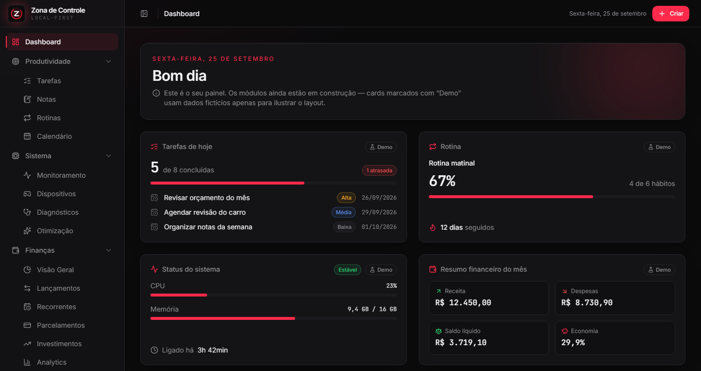

# Zona de Controle

[](https://github.com/BrunoStrufaldi/Zona-de-controle/actions/workflows/ci.yml)

> Hub de produtividade pessoal, central do sistema e gestão financeira — um app desktop **local-first** para Windows.



## Visão geral

O **Zona de Controle** reúne em um só lugar três áreas do dia a dia:

- **Produtividade pessoal**: tarefas, notas, rotinas e calendário.
- **Central do sistema**: monitoramento de hardware, diagnóstico, dispositivos/bateria e otimização **segura**.
- **Gestão financeira**: lançamentos, contas recorrentes, parcelamentos, investimentos e analytics.

Tudo roda localmente. Os dados ficam em um banco SQLite no seu computador, sem nuvem, sem contas e sem APIs externas.

> **Estado atual: Fases 5 (Finanças), 6 (Investimentos) e 7 (Analytics) concluídas.** A fundação está pronta e os módulos de **Tarefas** (lista, Kanban, recorrência, checklists, categorias, arquivo e dashboard), **Notas e diário**, **Rotinas**, **Calendário**, **Monitoramento** (CPU, memória, discos e processos ao vivo), **Diagnósticos** e **Dispositivos** já funcionam. A **Otimização** analisa e limpa, com confirmação, cancelamento, auditoria e histórico. Em **Finanças**, contas, lançamentos, transferências, categorias, a Visão Geral do mês, a importação de extratos do banco, as contas recorrentes, os parcelamentos, a carteira de investimentos, o desempenho dela e o Analytics (histórico e projeção) já funcionam. Os demais módulos serão implementados um a um (veja o [Roadmap](#roadmap)). Os cards do dashboard marcados com **Demo** usam dados fictícios só para ilustrar o layout.

## Stack

| Camada            | Tecnologia                                                   | Por quê                                                                                                                            |
| ----------------- | ------------------------------------------------------------ | ---------------------------------------------------------------------------------------------------------------------------------- |
| Desktop           | **Tauri 2** (Rust)                                           | Binário pequeno, usa o WebView2 nativo do Windows, com modelo de permissões granular (capabilities) e acesso seguro ao SO via Rust |
| Linguagem nativa  | **Rust** (stable)                                            | Segurança de memória e acesso ao sistema (bateria, discos, arquivos) sem expor nada ao JavaScript                                  |
| UI                | **React 19 + TypeScript 6 (strict)**                         | Ecossistema maduro, tipagem forte de ponta a ponta                                                                                 |
| Build             | **Vite 8**                                                   | Dev server rápido, HMR e code splitting por rota                                                                                   |
| Rotas             | **React Router 8** (data router)                             | Rotas declarativas, carregamento sob demanda e tratamento de erro por rota                                                         |
| Estilo            | **Tailwind CSS 4** + tokens em CSS variables                 | Tema centralizado e fácil de trocar, sem CSS espalhado                                                                             |
| Componentes       | Padrão **shadcn/ui** (Radix UI + CVA)                        | Acessibilidade pronta (Radix) com código dentro do projeto, sem lock-in                                                            |
| Ícones            | **Lucide React**                                             | Conjunto consistente e leve                                                                                                        |
| Estado global     | **Zustand**                                                  | Mínimo e sem boilerplate. Usado só para estado de UI                                                                               |
| Gráficos          | **Recharts**                                                 | Declarativo, integra bem com React e aceita os tokens do tema                                                                      |
| Arrastar e soltar | **@dnd-kit** (core + sortable)                               | Kanban acessível: funciona com mouse e teclado, com anúncios para leitores de tela                                                 |
| Toasts            | **Sonner**                                                   | Notificações acessíveis, recomendadas pelo shadcn                                                                                  |
| Banco             | **SQLite via `rusqlite` (bundled)**                          | Arquivo único local; o SQLite vem embutido, sem instalação. **Todo SQL fica no Rust**                                              |
| Testes            | **Vitest + Testing Library** / `cargo test`                  | Testes rápidos e o mesmo pipeline do Vite                                                                                          |
| Qualidade         | ESLint (type-checked), Prettier, `cargo fmt`, `cargo clippy` | Padrão consistente e verificável                                                                                                   |

### Decisões técnicas

- **SQLite só no Rust.** O frontend nunca executa SQL: ele chama commands tipados (`src/services`). Por isso o plugin SQL do Tauri **não** é usado.
- **TypeScript fixado em 6.0.** O TS 7 já existe, mas o `typescript-eslint` ainda não o suporta. A atualização fica para quando houver compatibilidade.
- **Tauri 2 estável.** A versão 3 está em alpha.
- **`freezePrototype` desativado.** A opção quebra o `decimal.js-light` (dependência do Recharts), que redefine `valueOf` no próprio protótipo. A segurança continua garantida pela CSP e pelo modelo de capabilities.
- **Fontes empacotadas** (`@fontsource-variable`). Nenhuma requisição ao Google Fonts ou a qualquer servidor externo.

## Funcionalidades

### Produtividade (Fase 2)

- **Tarefas** ✅ (2.1 e 2.2): lista e Kanban, status, prioridades, vencimento com destaque (atrasada, hoje, em breve), tags, busca e filtros, recorrência, checklists, categorias e arquivamento.
- **Notas e diário** ✅ (2.3): editor Markdown, notas rápidas, diário por data, busca, tags, favoritos, pastas e histórico.
- **Rotinas** ✅ (2.4): rotinas diárias e semanais, hábitos, histórico de execução e indicadores de consistência.
- **Calendário** ✅ (2.5): eventos, lembretes, recorrência, notificações locais e visões mensal, semanal e diária.

### Monitoramento do sistema (Fases 3 e 4)

- **Monitoramento** ✅ (3.1): CPU (total e por núcleo), memória, arquivo de paginação e discos ao vivo (a cada 2 s, com gráficos dos últimos 2 minutos), processos agrupados por programa com busca e ordenação (somente leitura) e informações do computador. Nada é gravado: as leituras existem só enquanto a tela está aberta. A temperatura aparece como "Não disponível": no Windows os sensores só são liberados para administradores, e o app não pede elevação.
- **Diagnóstico** ✅ (3.2): verifica espaço em disco (incluindo o mínimo livre na unidade do Windows), memória, arquivo de paginação e programas pesados, com recomendações do que fazer. Analisa ao abrir a tela (e no card do dashboard), só com a leitura atual, sem notificações e sem alterar nada no sistema. Os limites são ajustáveis em Configurações > Diagnóstico (validados e auditados).
- **Dispositivos e bateria** ✅ (3.3a e 3.3b): periféricos sem fio com nível de bateria, tipo de conexão e última leitura. Tudo somente leitura, de três fontes:
  - **Receptores 2.4 GHz** (`hidapi`): detecta o receptor USB pelo `vid:pid`. Pela USB um receptor e um aparelho com fio parecem iguais, então o usuário marca uma vez "é sem fio" (auditado); modelos conhecidos já vêm reconhecidos. A bateria depende de um leitor próprio por modelo: hoje, o headset **MCHOSE V9 PRO** e o mouse **Rapoo VT7 Max**. O app só **escuta** o que o receptor avisa sozinho (nível, carregando, desligado) e nunca envia comandos. O mouse repete o status a cada poucos segundos; o headset só avisa ao ligar, desligar ou mudar o carregamento, então até o primeiro aviso a bateria aparece como "Aguardando leitura". Desligado, mostra o último nível informado, com a hora da leitura ao lado. A última leitura fica salva: ao abrir o app de novo, aparece como "Último registro: 80%", com data e hora, até o aparelho mandar um aviso novo (nunca como se fosse o nível atual);
  - **Controles Xbox** (XInput): nível por faixas;
  - **Bluetooth**: a bateria que o próprio Windows informa para dispositivos pareados.

  Cada dispositivo informa um nível de suporte (`supported`, `partial`, `unsupported`). Quando a bateria não pode ser lida, a interface mostra **"Não disponível"** e nunca estima um valor.

- **Otimização segura** (4.1 ✅ análise; 4.2 ✅ limpeza; 4.3 ✅ histórico): encontra o que pode ser limpo, mostra a lista exata, arquivo por arquivo, com o tamanho de cada um, e limpa só o que você marcar e confirmar. Só entram pastas de uma allowlist dentro do perfil do usuário, lidas sem seguir links, junções ou arquivos só na nuvem e sem pedir administrador:
  - **Temporários**: a pasta Temp do usuário, só com arquivos criados **e** modificados há mais de 24 horas (instaladores extraem arquivos com a data antiga do pacote, então a data de criação também conta);
  - **Caches seguros**: shaders do DirectX, NVIDIA e AMD; relatórios de erro do Windows e despejos de travamento; miniaturas do Explorer; cache de páginas, código e GPU do Chrome, Edge, Brave e Firefox (nunca cookies, senhas, histórico ou extensões). Com o navegador aberto, o cache dele aparece como "Em uso";
  - **Lixeira**: os itens da Lixeira do usuário em cada unidade fixa, com o local original e a data da exclusão.

  **Limpeza** (4.2): marque os locais (os shaders vêm desmarcados, porque os jogos recompilam; caches de navegador aberto e locais vazios não podem ser marcados) e confirme numa janela que lista cada local, com a quantidade e o tamanho. A remoção é permanente e segura:
  - só apaga itens da última análise: a tela envia quais locais limpar, nunca caminhos, e a mesma análise não pode ser usada duas vezes;
  - confere cada arquivo de novo na hora: precisa continuar dentro da pasta analisada, sem link ou junção no caminho, com o mesmo tamanho e a mesma data. Arquivos em uso ou alterados são pulados; pastas que ficam vazias são removidas, mas nunca a pasta de origem;
  - a Lixeira só é esvaziada, pela API do Windows, se estiver igual à análise;
  - recusa rodar com o app aberto como administrador ou com o navegador dono do cache aberto;
  - mostra o andamento e pode ser cancelada entre um arquivo e outro. No fim, mostra quanto foi liberado e o que ficou (e por quê). Sucesso, cancelamento e falha vão para o log de auditoria.

  **Histórico** (4.3): as últimas limpezas na tela Otimização (data, resultado, locais, quanto liberou e o que ficou; as recusas aparecem com o motivo) e o total liberado. Vem direto do log de auditoria, que não pode ser apagado, então não há como o histórico divergir do que aconteceu. O dashboard ganhou o card **Limpeza**, com o total e a última limpeza (sem analisar as pastas).

### Finanças (Fases 5 a 7)

- **Visão Geral** ✅ (5.1): receita, despesas (com o que ainda está pendente), saldo líquido e percentual de economia do mês, saldo de cada conta, receita x despesas dos últimos 6 meses e despesas por categoria. O dashboard mostra o mesmo resumo e o gráfico com os dados reais.
- **Contas** ✅ (5.1): conta corrente, poupança, cartão de crédito, dinheiro ou outra, com saldo inicial (pode ser negativo, ex.: fatura em aberto). O saldo soma só os lançamentos pagos; conta com lançamentos não pode ser excluída. No cartão, dá para informar o dia de fechamento e o de vencimento da fatura (5.4).
- **Lançamentos** ✅ (5.1): entradas e saídas com conta, categoria, tags, observação e status (pago/recebido ou pendente, com destaque para pendentes atrasados), navegação por mês ou ano e filtros por tipo, status, categoria, conta, faixa de valor e busca sem acentos. Valores guardados em centavos. Categorias de receita e de despesa já vêm criadas (Moradia, Alimentação, Salário…) e podem ser editadas. Excluir lançamento, categoria ou conta pede confirmação e fica no log de auditoria.
- **Transferências** ✅ (5.2): entre as suas contas (pagamento da fatura, aplicação e resgate). Movem o saldo das duas contas e não contam como receita nem despesa. Há também o tipo de conta **Investimentos**.
- **Importação de extratos** ✅ (5.2): o extrato da conta em **OFX** e a fatura do cartão do **C6 em CSV**, exportados pelo app ou site do banco. O arquivo é lido só no computador (sem conexão com bancos ou agregadores) e nada é gravado antes da revisão:
  - cada linha aparece com a sugestão de tipo e categoria, que pode ser trocada; escolher a categoria de uma linha vale também para as parecidas;
  - o pagamento da fatura vira transferência para o cartão e aplicações/resgates viram transferência com os investimentos;
  - lançamentos já importados são reconhecidos (pelo identificador do banco no OFX) e pulados: importar o mesmo período de novo não duplica nada;
  - na fatura, as compras entram no mês do **vencimento**, com a data da compra e a parcela (ex.: 3/6) guardadas;
  - o app aprende: as categorias escolhidas viram sugestão nas próximas importações. Cada importação vai para o log de auditoria.
- **Recorrentes** ✅ (5.3): aluguel, internet, assinaturas, salário ou aportes cadastrados uma vez, com o valor previsto e a repetição (todo mês, a cada N semanas, todo ano…; sem fim, até uma data ou por N vezes):
  - os vencimentos de cada mês aparecem sozinhos, com o status (a pagar, atrasada, registrada, paga ou pulada), o total previsto, o que já foi pago e o que falta;
  - **Pagar** registra o lançamento com um clique (na data do vencimento); também dá para registrar com outro valor ou data, vincular a um lançamento que já existia ou pular o mês. Nada é criado antes: o lançamento só existe quando você registra;
  - na **importação do extrato**, a linha que bate com um vencimento em aberto (mesmo tipo, data próxima e valor parecido) já vem vinculada a ele. Depois do primeiro vínculo, o app reconhece a descrição do banco mesmo que o valor mude (ex.: conta de energia);
  - o compromisso mensal (contas fixas e receitas fixas por mês), os atrasos de meses anteriores e o aviso de fim próximo das assinaturas com prazo ("renovar?");
  - o dashboard mostra os **próximos vencimentos** e os atrasados. Excluir uma recorrente pede confirmação, vai para o log de auditoria e mantém os lançamentos já registrados;
  - **no cartão de crédito** não há o que pagar um a um: a recorrente fica "prevista", depois "aguardando fatura" (nunca atrasada) e, quando a fatura é importada, "na fatura". Não aparece em "próximos vencimentos" nem soma nos atrasos. Com o fechamento e o vencimento do cartão informados, cada cobrança mostra em que fatura cai.
- **Parcelamentos** ✅ (5.4): as compras parceladas saem sozinhas das faturas importadas (coluna Parcela, ex.: 4/10). Para cada compra: parcela atual, quanto falta, quantas parcelas restam e o mês da última. As parcelas que ainda não vieram são projetadas mês a mês:
  - resumo: quanto falta pagar em parcelas, em quantas compras, quanto pesa nas faturas deste mês e quando vence a última parcela;
  - gráfico e tabela das **faturas dos próximos 12 meses**: parcelas mais as recorrentes do cartão (com os dias da fatura), quanto a fatura alivia de um mês para o outro e quais compras encerram em cada mês;
  - compras quitadas ficam numa lista à parte.
- **Investimentos** (6.1 ✅): carteira com Renda fixa, Ações, FIIs, ETFs, Cripto e Outros. **Nenhuma cotação é baixada**: o valor atual de cada ativo é o que você informa, copiado do app do banco ou da corretora:
  - cada ativo fica numa conta do tipo Investimentos (a instituição) e registra aplicações, resgates e proventos, com quantidade opcional (até 8 casas, para cripto e Tesouro) e preço médio;
  - ao registrar, dá para escolher a conta de onde sai (ou para onde vai) o dinheiro: a transferência é criada e fica vinculada. As transferências que já existem (ex.: "APLICACAO CDB" importada do extrato) aparecem em **Aplicações e resgates sem ativo** e são vinculadas com um clique;
  - **Atualizar valores** informa o valor de todos os ativos de uma vez. Depois do último valor informado, só as aplicações e os resgates entram na conta, e o ativo aparece como "Atualizar valor"; sem nenhum valor informado, considera o que foi aplicado;
  - resultado de cada ativo e da carteira (valor + resgates + proventos − aplicações), distribuição por classe e **patrimônio total** (contas + dinheiro parado nas contas de investimentos + carteira), sem contar o mesmo dinheiro duas vezes;
  - resgate total encerra o ativo; o histórico de cada ativo mostra as movimentações e os valores informados. Excluir ativo, movimentação ou valor pede confirmação e fica no log de auditoria (os lançamentos vinculados continuam);
  - card **Investimentos** no dashboard.
- **Desempenho dos investimentos** (6.2 ✅), na aba Desempenho, sempre a partir dos valores informados:
  - resultado e rentabilidade do período (este mês, este ano, 12 meses ou desde o início): valor no início e no fim, aplicações, resgates e proventos. A rentabilidade desconta o tempo que cada aplicação ficou investida (método de Dietz modificado), então aplicar no meio do período não conta como ganho;
  - ativos sem valor informado recente (até 35 dias) no início ou no fim do período aparecem como **aproximados**: o resultado deles considera só o que foi aplicado;
  - evolução mês a mês (até 24 meses) do valor da carteira e do aplicado líquido, proventos por mês e o resultado de cada ativo no período;
  - vencimentos da renda fixa, com aviso para os títulos que já venceram e ainda não tiveram o resgate registrado.
- **Analytics** (7.1 ✅ histórico), por período (6 meses, 12 meses, este ano ou ano passado):
  - receita, despesas, receita − despesas e o percentual economizado, com as médias por mês. As médias usam só os meses completos desde o primeiro registro (o mês atual, ainda em andamento, fica de fora);
  - receita x despesas e receita − despesas mês a mês, com os meses no vermelho destacados;
  - evolução do patrimônio ao fim de cada mês: saldo das contas (só o que foi pago; cartões entram negativos) mais os investimentos pelo valor informado, sem contar duas vezes o dinheiro aplicado. Meses antes do primeiro registro ficam sem ponto, nunca como zero;
  - despesas por categoria no período, com a participação e a variação sobre o período anterior de mesmo tamanho; escolher uma categoria mostra os gastos dela mês a mês;
- **Projeção** (7.2 ✅), na aba Projeção do Analytics: o saldo das contas do dia a dia (sem as de investimentos) ao fim do mês atual e dos próximos 6:
  - **valores conhecidos**: vencimentos em aberto das recorrentes (as do cartão no vencimento da fatura), parcelas (as das faturas importadas e as que ainda vão vir) e lançamentos já registrados com data futura ou pendentes;
  - **estimativa**, sempre separada e marcada: a média dos últimos 6 meses do que não é recorrente nem parcela (mercado, lazer, Pix avulsos…), menos o que já está lançado no mês. O gráfico e a tabela mostram o saldo com e sem ela;
  - menor saldo previsto, quanto vai em parcelas por mês e quando elas diminuem;
  - avisos quando algo pode distorcer a conta: recorrentes pagas sem vínculo (entrariam em dobro) e cartões sem os dias da fatura. Transferências e aplicações não entram.

### Já funcional

- **Tarefas**:
  - criar, editar, concluir e excluir, com exclusão só após confirmação e registrada na auditoria;
  - visão Lista com busca sem acentos e filtros por status, prioridade e tag;
  - visão Kanban com arrastar e soltar pelo mouse ou pelo teclado (↑↓ muda a posição, ←→ muda de coluna) e a opção "Mover para" no menu;
  - **recorrência** diária, semanal (com dias da semana), mensal ou anual, a cada N períodos. Ao concluir, a próxima ocorrência é criada com o vencimento seguinte e a regra passa para ela. Concluir com atraso pula as datas que já passaram;
  - **checklists** dentro da tarefa, com progresso ("2/5") e itens marcáveis direto na lista e no Kanban;
  - **categorias** criadas pelo usuário, com nome e cor (uma por tarefa), filtro por categoria e exclusão confirmada e auditada. A tarefa perde a categoria, mas não é excluída;
  - **arquivamento** manual ou em lote ("Arquivar concluídas"). Tarefas arquivadas saem da lista, do Kanban e do dashboard e ficam na aba Arquivadas, de onde podem ser restauradas ou excluídas;
  - widget "Tarefas de hoje" no dashboard com dados reais.
- **Notas e diário**:
  - editor Markdown com salvamento automático e modos Editar, Dividir (lado a lado) e Visualizar. A prévia suporta títulos, listas, tarefas (`- [ ]`), tabelas, citações e código. HTML bruto nunca é renderizado; links e imagens aparecem só como texto, sem abrir nem baixar nada;
  - pastas (excluir uma pasta não exclui as notas), tags compartilhadas com as tarefas, favoritas e busca sem acentos no título, no conteúdo e nas tags;
  - **diário**: uma nota por dia, com navegação por data. A nota do dia só é criada quando você começa a escrever;
  - **histórico de versões** automático: guarda o texto anterior ao editar (no máximo uma versão a cada 5 minutos) e mantém as 20 mais recentes. Restaurar uma versão também guarda o texto atual;
  - exclusão de nota ou pasta só após confirmação, registrada na auditoria.
- **Rotinas**:
  - rotinas com hábitos, feitas todo dia ou em dias fixos da semana (ex.: seg/qua/sex);
  - grade com os últimos 8 dias: marque os hábitos de hoje ou corrija até 7 dias atrás, só em dias da agenda;
  - **sequência** de dias completos (todos os hábitos feitos), recorde e consistência dos últimos 30 dias. Dias fora da agenda são ignorados, e hoje ainda em andamento não quebra a sequência;
  - editar uma rotina não reescreve o passado: hábitos removidos deixam de valer a partir de hoje e hábitos novos contam a partir de hoje;
  - widget "Rotinas de hoje" no dashboard com dados reais;
  - exclusão só após confirmação, registrada na auditoria.
- **Calendário**:
  - visões **mensal**, **semanal** e **diária**, com navegação por período e botão "Hoje". Na grade de horários, eventos sobrepostos ficam lado a lado e uma linha marca a hora atual; clicar num horário vazio cria um evento ali;
  - eventos com horário ou de dia inteiro, de um ou vários dias, com cor, local e descrição;
  - **repetição** diária, semanal (com dias da semana), mensal ou anual, a cada N períodos, sem fim, até uma data ou por N vezes. É possível editar ou excluir **só uma ocorrência** ou **toda a série**. Mudar o início ou a repetição da série descarta as alterações individuais, com aviso no formulário e registro na auditoria;
  - **lembretes** (de "no horário" a 1 semana antes; no dia inteiro, contados a partir das 09:00) mostrados como notificação do Windows e como aviso dentro do app, enquanto o app estiver aberto (mesmo minimizado). Cada lembrete é avisado uma única vez; atrasos de até 15 minutos (ex.: PC suspenso) ainda são avisados;
  - **tarefas com vencimento** aparecem no dia, somente leitura, com link que abre a tarefa na página de Tarefas;
  - widget "Próximos eventos" (7 dias) no dashboard com dados reais e atalho "Novo evento" no menu Criar;
  - exclusão só após confirmação, registrada na auditoria.
- Layout completo, navegação entre as 16 páginas e página 404.
- Persistência SQLite com migrations versionadas executadas na inicialização.
- **Configurações**: nome de exibição salvo no banco (usado na saudação), log de auditoria, informações do app e vitrine do design system.
- **Backup** (Configurações › Dados): cópia completa e verificada do banco em `Documentos\Zona de Controle\Backups`, feita com o app aberto (`VACUUM INTO` + `quick_check`). O app nunca apaga nem sobrescreve backups. Para restaurar, feche o app e substitua `zona-de-controle.db` pela cópia, apagando os arquivos `-wal` e `-shm`.
- **Otimização**: quanto dá para liberar em cada categoria, a lista exata dos itens (maiores primeiro, por página) a limpeza dos locais marcados, com confirmação, andamento, cancelamento e auditoria, o histórico das limpezas e o card Limpeza no dashboard.

## Design System

**Estilo:** Dark + Red, futurista e minimalista. Superfícies escuras em camadas, vermelho como cor de ação e destaque, e brilho sutil em foco e hover.

### Cores (tokens em `src/styles/tokens.css`)

| Token                                           | Valor                 | Uso (classe Tailwind)                                         |
| ----------------------------------------------- | --------------------- | ------------------------------------------------------------- |
| `--zdc-background`                              | `#0B0B0C`             | Fundo principal (`bg-background`)                             |
| `--zdc-surface`                                 | `#141416`             | Cards (`bg-card`)                                             |
| `--zdc-surface-raised`                          | `#1B1B1F`             | Popovers, campos, trilhas (`bg-raised`)                       |
| `--zdc-border`                                  | `#26262B`             | Bordas (`border-border`)                                      |
| `--zdc-primary`                                 | `#FF2A4B`             | Vermelho principal (`bg-primary`, `text-primary`)             |
| `--zdc-primary-strong`                          | `#E50914`             | Vermelho alternativo, hover do primário (`bg-primary-strong`) |
| `--zdc-text`                                    | `#F3F3F6`             | Texto principal (`text-foreground`)                           |
| `--zdc-text-muted`                              | `#8E8E93`             | Texto secundário (`text-muted-foreground`)                    |
| `--zdc-success` / `warning` / `danger` / `info` | —                     | Estados (sempre com ícone ou rótulo, nunca só cor)            |
| `--zdc-chart-1` / `--zdc-chart-2`               | `#FF2A4B` / `#5B8DEF` | Paleta de gráficos validada para contraste e daltonismo       |

Para trocar o tema, basta editar `tokens.css`. Os componentes não usam hexadecimais.

### Tipografia

- **Inter Variable** para a interface e **JetBrains Mono Variable** para números, valores e códigos (com `tabular-nums` para alinhar colunas).
- Hierarquia: títulos de página em `text-2xl/semibold`, títulos de card em `text-sm/medium` (secundários) e valores de destaque em `text-3xl` mono.

### Espaçamento e forma

- Escala padrão do Tailwind (base de 4px). O conteúdo usa `gap-6` e `p-6`/`p-8`, com largura máxima de `max-w-7xl`.
- Raio base de `0.75rem` (`--zdc-radius`), com variantes `sm`, `md`, `lg` e `xl`.

### Componentes

- **Base (`components/ui`)**: Button, Card, Badge, Input, Textarea, Label, Checkbox, Select, Dialog, AlertDialog, DropdownMenu, Tabs, Progress, Table, Tooltip, Skeleton e Toaster.
- **Compostos (`components/shared`)**: PageHeader, EmptyState, LoadingState, ErrorState, DemoBadge, WidgetCard, ModulePlaceholder, ResourceView e TagInput.
- A aba **Configurações → Aparência** mostra todos os componentes ao vivo.

### Sidebar

- Fixa e expandida no desktop, com grupos expansíveis (Produtividade, Sistema e Finanças) cujo estado é lembrado.
- Pode ser recolhida manualmente para um trilho de ícones com tooltips, pelo botão no header.
- Em janelas com menos de 1024px, vira automaticamente um trilho de ícones e abre como sobreposição (fecha com Esc, clique fora ou ao navegar).
- É gerada a partir de `src/config/navigation.ts`, que também alimenta o breadcrumb e os títulos das páginas.

### Animações

- Sutis: `fade-in` na troca de página, `slide-up` em cards e cabeçalhos, `scale-in` em popovers, brilho vermelho (`shadow-glow`) em hover e foco, e microinterações em botões.
- Respeitam `prefers-reduced-motion`: as animações são praticamente desligadas quando o sistema pede menos movimento.

## Arquitetura

```
src/                          Frontend (React)
├── app/                      Composição: router/ (paths, rotas), layouts/, providers/
├── config/                   Configuração declarativa (navegação)
├── components/
│   ├── ui/                   Primitivos visuais (padrão shadcn)
│   ├── layout/               Sidebar, header, breadcrumb
│   └── shared/               Componentes compostos reutilizáveis
├── features/                 Um diretório por módulo
│   ├── productivity/         tasks/ (types, domain, hooks, components) + contratos futuros
│   ├── system/               + devices/ e optimization/ (contratos)
│   └── finance/
├── pages/                    Páginas das rotas (compõem features)
├── hooks/                    Hooks genéricos (useAsyncResource, useMediaQuery…)
├── stores/                   Zustand, só estado de UI
├── services/                 Único ponto de acesso ao backend (commands tipados)
├── lib/                      Utilitários puros: formatação pt-BR, math, navegação
├── mocks/                    Dados fictícios de demonstração (sempre com selo Demo)
├── types/                    Tipos compartilhados
├── styles/                   tokens.css + globals.css
└── test/                     Setup do Vitest e helpers

src-tauri/                    Backend (Rust)
├── src/
│   ├── commands/             Camada IPC (fina), leitura e escrita separadas
│   ├── services/             Casos de uso: validação, transações, auditoria
│   ├── repositories/         Único lugar com SQL
│   ├── domain/               Regras e contratos (audit, settings, tasks, notes, routines, tags, calendar…)
│   ├── platform/             Leitura do sistema operacional (somente leitura, via sysinfo)
│   ├── db/                   Conexão SQLite + runner de migrations
│   ├── error.rs              AppError → { kind, message }
│   └── state.rs              Estado gerenciado (banco, providers, monitor do sistema)
├── migrations/               SQL versionado (0001_initial … 0006_calendar, 0007_device_markings)
├── capabilities/             Permissões mínimas, comentadas
└── build.rs                  Lista explícita de commands permitidos
```

**Fluxo de dados:** página → hook → `services/*` → `invokeCommand` → _IPC_ → `commands` → `services` → `repositories`/`domain` → SQLite. Leituras do sistema operacional: `commands` → `platform` (somente leitura) → `domain`.

**Banco de dados:** `%APPDATA%\com.brunostrufaldi.zonadecontrole\zona-de-controle.db`. As migrations rodam na inicialização. Tabelas:

- `app_settings`: preferências em chave/valor, com o valor em JSON validado.
- `audit_log`: registro de operações sensíveis. É somente inserção, com triggers que impedem alteração e exclusão.
- `tasks`, `tags` e `task_tags`: tarefas, com posição fracionária por coluna do Kanban, regra de recorrência em JSON e data de arquivamento. As tags são compartilhadas entre módulos.
- `task_checklist_items`: itens de checklist de cada tarefa, excluídos em cascata junto com ela.
- `task_categories`: categorias com nome único e uma cor da paleta de tokens. Excluir uma categoria só remove o vínculo com as tarefas (`ON DELETE SET NULL`).
- `notes`, `note_tags`, `note_folders` e `note_versions`: notas em Markdown (as do diário têm `journal_date`, única por dia), tags na mesma tabela `tags` das tarefas, pastas (`ON DELETE SET NULL`) e histórico de versões, excluído em cascata com a nota.
- `routines`, `habits` e `habit_completions`: rotinas (dias da semana em máscara de bits e data de início), hábitos com período de validade (`created_on`/`removed_on`, para o histórico não mudar ao editar) e marcações por dia.

**Segurança:** a capability concede apenas os commands do próprio app e três permissões do plugin oficial de notificação (consultar/pedir permissão e notificar, para os lembretes), sem plugins de acesso ao sistema e sem permissões `core:*`. A CSP é restritiva e não há execução de shell. As operações destrutivas são a exclusão de tarefas, categorias, notas, pastas de notas, rotinas e eventos (série ou ocorrência). Todas exigem confirmação explícita e são auditadas, tanto no sucesso quanto na falha. Arquivar não apaga dados. O backup só cria arquivos novos (também auditado) e não existe command que apague, sobrescreva ou restaure arquivos.

## Pré-requisitos (Windows 11)

1. **Node.js LTS** (≥ 22.12; testado com 24): https://nodejs.org
2. **Rust** via rustup, com a toolchain `stable-x86_64-pc-windows-msvc`:
   ```powershell
   winget install --id Rustlang.Rustup -e
   ```
   Depois, reabra o terminal ou o VS Code para carregar o PATH.
3. **Microsoft C++ Build Tools**, com a carga de trabalho _"Desenvolvimento para desktop com C++"_ (MSVC + Windows SDK): https://visualstudio.microsoft.com/visual-cpp-build-tools/
4. **WebView2 Runtime**: já vem instalado no Windows 11.

## Desenvolvimento

```bash
npm install          # dependências do frontend (o Rust baixa as crates no primeiro build)
npm run dev          # abre o APP DESKTOP em modo desenvolvimento (tauri dev)
npm run dev:web      # só o frontend no navegador (recursos do banco mostram "apenas no desktop")
```

| Script                            | Função                                                  |
| --------------------------------- | ------------------------------------------------------- |
| `npm run dev`                     | App desktop em desenvolvimento (`tauri dev`)            |
| `npm run dev:web`                 | Apenas o frontend no navegador (Vite)                   |
| `npm run build`                   | Build do frontend (typecheck + Vite)                    |
| `npm run build:desktop`           | Build de produção do app e instaladores (`tauri build`) |
| `npm run lint`                    | ESLint                                                  |
| `npm run format` / `format:check` | Prettier (formatar / verificar)                         |
| `npm run typecheck`               | TypeScript (`tsc -b`)                                   |
| `npm run check`                   | Typecheck + lint + `cargo check`                        |
| `npm run check:rust`              | `cargo fmt --check` + `cargo clippy -D warnings`        |
| `npm run format:rust`             | `cargo fmt`                                             |
| `npm run test` / `test:watch`     | Testes do frontend (Vitest)                             |
| `npm run test:rust`               | Testes do Rust (`cargo test`)                           |

## Build

```bash
npm run build:desktop
```

Os artefatos ficam em `src-tauri/target/release/`:

- `zona-de-controle.exe`: executável;
- `bundle/msi/*.msi` e `bundle/nsis/*-setup.exe`: instaladores.

O primeiro build de release demora alguns minutos, porque compila com LTO e baixa as ferramentas WiX e NSIS.

## Integração contínua

O workflow [`.github/workflows/ci.yml`](.github/workflows/ci.yml) roda a cada push, em qualquer branch:

| Job      | Runner  | Etapas                                                   |
| -------- | ------- | -------------------------------------------------------- |
| Frontend | Ubuntu  | `npm ci`, typecheck, lint, `format:check`, testes, build |
| Rust     | Windows | `cargo fmt --check`, `clippy -D warnings`, `cargo test`  |

- Um novo push na mesma branch cancela a execução anterior.
- O cache de dependências (npm e Cargo) reduz o tempo das execuções seguintes.
- O **Dependabot** ([`.github/dependabot.yml`](.github/dependabot.yml)) abre PRs semanais agrupados para npm e Cargo, e mensais para as Actions. O TypeScript ≥ 6.1 e as versões major do Tauri são ignorados de propósito (veja [Decisões técnicas](#decisões-técnicas)).
- A versão do Node usada na CI vem de `.nvmrc`.

## Roadmap

- **Fase 1 — Foundation** ✅: boilerplate, design system, layout, navegação, Tauri e SQLite preparado.
- **Fase 2 — Productivity** ✅: tarefas ✅ (2.1); recorrência, checklists, categorias e arquivamento ✅ (2.2); notas e diário ✅ (2.3); rotinas ✅ (2.4); calendário ✅ (2.5).
- **Fase 3 — System Monitor**: monitoramento de CPU, RAM, discos e processos ✅ (3.1); diagnósticos ✅ (3.2); dispositivos e bateria ✅ (3.3a: receptores 2.4 GHz, controles Xbox e Bluetooth; 3.3b: bateria do headset MCHOSE V9 PRO e do mouse Rapoo VT7 Max pelo receptor).
- **Fase 4 — Safe Optimization** ✅: análise de temporários, caches seguros e Lixeira (4.1); limpeza com confirmação, auditoria e cancelamento (4.2); histórico das limpezas e card no dashboard (4.3).
- **Fase 5 — Finance Core**: contas, lançamentos, categorias e Visão Geral ✅ (5.1); transferências e importação de extratos OFX/CSV ✅ (5.2); recorrentes ✅ (5.3); parcelamentos ✅ (5.4).
- **Fase 6 — Investments**: carteira, valores informados, aportes vinculados e patrimônio ✅ (6.1); evolução da carteira, rentabilidade, proventos por período e vencimentos ✅ (6.2). A importação dos investimentos (6.3) foi dispensada: o C6 não exporta posição nem movimentações; as aplicações e os resgates chegam pelo extrato OFX da conta corrente (e são ligados aos ativos) e o valor atual é informado.
- **Fase 7 — Analytics**: receita x despesas, categorias e evolução do patrimônio mês a mês ✅ (7.1); projeção de 6 meses e impacto das parcelas ✅ (7.2).
- **Fase 8 — Polish**: performance, acessibilidade, testes, refinamento visual e empacotamento.

## Contribuindo

As regras do projeto (arquitetura, convenções, segurança, mocks e validação) estão no [`CLAUDE.md`](CLAUDE.md). Antes de concluir qualquer mudança, rode `npm run check`, `npm run check:rust`, `npm run test`, `npm run test:rust` e `npm run build`.
